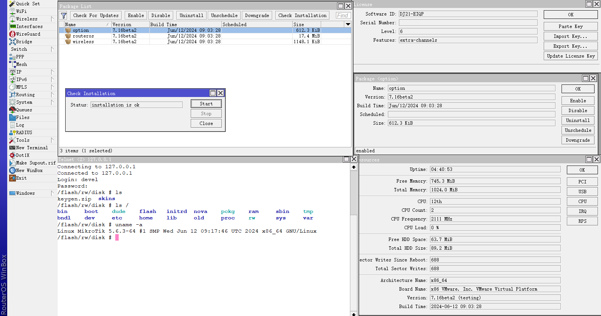
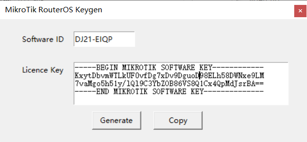

# Patch MikroTik RouterOS [[English](README.md)]

###  [MikroTik RouterOS 授权签名验证分析](https://blog.csdn.net/chivalrys/article/details/139770711) 

### 下载 [最新](https://github.com/elseif/MikroTikPatch/releases/latest) 的iso文件安装RouterOS.
### CHR镜像文件同时支持BIOS和UEFI启动模式

### 使用ISO或IMG内的Keygen生成授权许可

## 如何生成授权许可 (Keygen.exe在windows命令行下运行)
    keygen.zip在iso或者img文件的根目录下；chr镜像文件/rw/disk/目录下，和winbox打开后files目录一致。
    解压缩 keygen.zip
    运行 keygen.exe 输入software_id
## 如何使用Shell
    安装 option-{version}.npk 包
    telnet到RouterOS,用户名devel,密码与admin的密码相同
## 如何使用Python
    安装 python3-{version}.npk 包
    telnet到RouterOS,用户名devel,密码与admin的密码相同
    运行 python -V
## x86和Chr如何转换(Chr模式自动扩容硬盘)
    转换到Chr,在shell中运行下面命令
    echo -e "\x01" | dd of=/dev/sda bs=1 count=1 seek=336 conv=notrunc
    转换到x86,在shell中运行下面命令
    echo -e "\x00" | dd of=/dev/sda bs=1 count=1 seek=336 conv=notrunc
    如果硬盘扩容了，需要切换到Chr启动后，硬盘才会自动扩容，然后再切换为x86模式重新启动。
### npk.py
    对npk文件进行解包，修改，创建，签名和验证
### patch.py
    替换公钥并签名
### netinstall.py
    替换 netinstallexe 中的bootloader的公钥，使通过网络安装时可以安装ISO文件内的npk文件
### upgrade.py
    在RouterOS内增加静态域名解析，使升级时可以安装ISO文件内的npk文件
## 所有的修补操作都自动运行在[Github Action](https://github.com/elseif/MikroTikPatch/blob/main/.github/workflows/mikrotik_patch.yml)。

